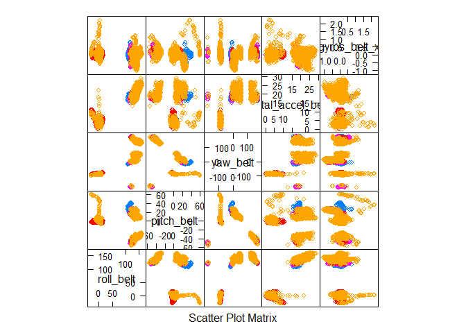

# Prediction Assignment
May 20, 2017  


## Load and Inspect the Data  


```r
train <- read.csv("pml-training.csv")
```

First thing I did was look at the dimensions and variable names in the data file (not shown), and noticed that many of the columns are summarizations of sections of the data (namely, each window of time recorded with the devices). I decided to remove those columns since they represented a different level of analysis.

I also removed:  
  1. "X" because it is not a variable but a residual row index from the csv files;  
  2. "username" because it cannot extrapolate to other users;  
  3. "timestamps"; and  
  4. "new window" and "window index" variables.  

```r
rm.cols <- c(1:7,12:36,50:59,69:83,87:101,103:112,125:139,141:150)
train <- train[,-rm.cols]
```

## Exploring the Data  


```r
library(caret)
featurePlot(x=train[,1:5],y=train$classe,plot="pairs")
```

<!-- -->

Taking a look at a subset of the variables, it appears that a linear model would not be appropriate for predicting the class of the exercise. I decided to begin with a random forest model to predict the class.

## Preparing the Data and Computer  
The first thing I did was segment off some of the training set to be a validation set for assessing accuracy before finalizing the model.

```r
library(randomForest)
set.seed(543)
inTrain <- createDataPartition(y=train$classe,p=0.9,list=F)
mytrain <- train[inTrain,]
myvaldt <- train[-inTrain,]
```

```r
dim(mytrain);dim(myvaldt)
```

```
## [1] 17662    53
```

```
## [1] 1960   53
```

Ninety percent going to the training set seemed appropriate since that left nearly 2000 in the validation set.  
  
During initial testing of the model and code, the analysis was taking a while to load. So I used the parallel and doParallel packages to process the analysis using multiple CPU cores. The following assigns all but one core to the task of running the model.

```r
library(parallel)
library(doParallel)
cluster <- makeCluster(detectCores() - 1) 
```

## Setting the Model Parameters  
In setting up the random forest model, I decided to use a repeated cross-validation procedure with 3 repeats, and k=10 fold cross-validation. A key variable that can be modified is the mtry variable, which specifies how many variables to sample to determine each split in the tree.

```r
k = 10 
reps = 3 
mtry = 7 
set.seed(1234)
seeds =  as.list(sample(1:99999,1+reps*k));
tC <- trainControl(
      method="repeatedcv",
      number=k,
      repeats=reps,
      seeds = seeds, #to ensure reproducibility
      allowParallel = TRUE)
```
*Seeds were also specified to ensure exact reproducibility.*  

## Running the Model  
With the parameters set, the following code registers the CPU clusters and runs the model.

```r
registerDoParallel(cluster)
mod1 <- train(classe~., data=mytrain, method="rf", metric="Accuracy",
              tuneGrid=expand.grid(mtry=mtry),  
              trControl=tC
)
stopCluster(cluster)
registerDoSEQ()
```

## Assessing the model

```r
mod1
```

```
## Random Forest 
## 
## 17662 samples
##    52 predictor
##     5 classes: 'A', 'B', 'C', 'D', 'E' 
## 
## No pre-processing
## Resampling: Cross-Validated (10 fold, repeated 3 times) 
## Summary of sample sizes: 15896, 15897, 15895, 15895, 15898, 15895, ... 
## Resampling results:
## 
##   Accuracy   Kappa    
##   0.9962064  0.9952013
## 
## Tuning parameter 'mtry' was held constant at a value of 7
```
The final model has an accuracy of 99.6% on the training set. The next step is to evaluate the model on the separate validation set. 

```r
predVal <- predict(mod1$finalModel,myvaldt)
table(predVal,myvaldt$classe)
```

```
##        
## predVal   A   B   C   D   E
##       A 558   2   0   0   0
##       B   0 377   0   0   0
##       C   0   0 342   2   0
##       D   0   0   0 319   0
##       E   0   0   0   0 360
```

```r
valAcc <- mean(predVal==myvaldt$classe)
valAcc
```

```
## [1] 0.9979592
```
As you can see, the model actually had 99.8% accuracy on the validation set.  

To improve the model, steps could be taken to try different mtry values, possibly changing the number of trees created, modifying k (the number of folds), or even the number of repeats. But given that the model had nearly perfectly predicted 1,960 new samples, I'm considering this my final model.  
  
  
*The data for this project come from this source:* http://groupware.les.inf.puc-rio.br/har.


